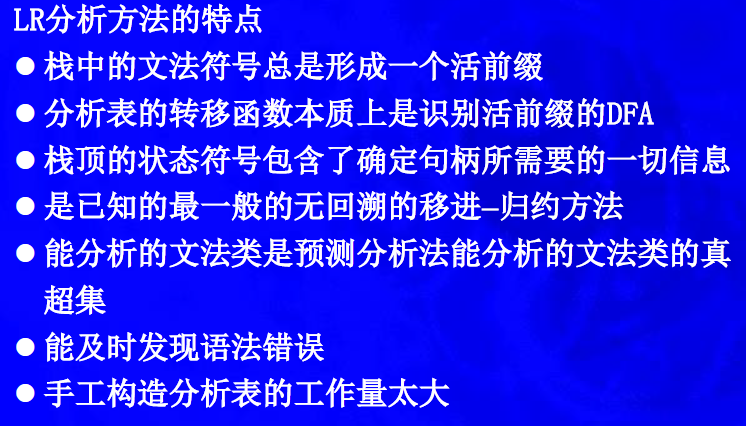
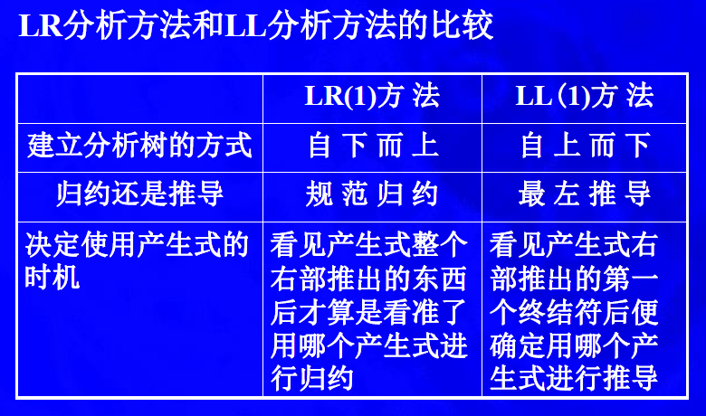
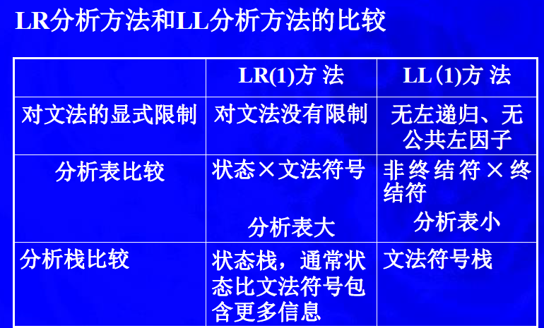
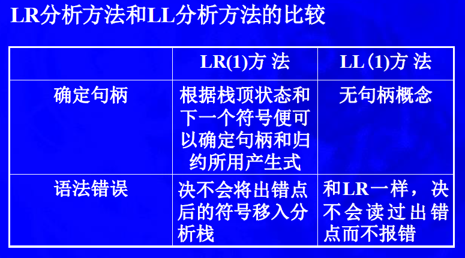
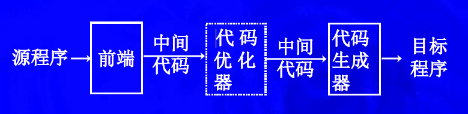

# 编译原理知识点汇总
## 编译程序包含有多少个阶段，各阶段的功能任务分别是什么？
6个阶段
- 扫描程序阶段：执行词法分析，从字符流中收集字符序列到称作记号的有意义单元中
- 语法分析阶段：从扫描程序中获取记号形式的源码，完成定义程序结构元素及关系的工作。
- 语义分析阶段：分析静态语义（包括声明和类型检查），得到程序计算的额外信息
- 源代码优化阶段：完成代码优化
- 代码生成阶段：生成目标代码
- 目标代码优化阶段：改进目标代码，将速度慢的指令改成速度快的，删除冗余操作

## 词法分析
- 正则表达式
- NFA:非确定有限状态机
- DFA:确定有限状态机

### NFA vs DFA
两种的差别在于确定和不确定，也就是对于转换函数 δ 的限制：

- DFA 的转换函数 δ  对于一组输入 ( s , c ) , s ∈ S , c ∈ ∑ (s,c),s∈S,c∈∑ 有唯一确定的输出，即 ∣ δ ( s , c ) ∣ = 1 | 
- 而 NFA 的转换函数对于同一种输入则可能存在多个输出状态，即 ∣ δ ( s , c ) ∣ > 0 


### 正则表达式转NFA:Thompson 构造法

#### 基础规则
1. 对于 ε，构造为


2. 对于a （输入的字符以a为例），构造为


一个圆圈前加一个箭头表示初始状态，两个圆圈表示终结状态，中间用箭头连接，箭头上标明要输入的字符
#### 归纳规则

1. 对于 a | b，构造为


2. 对于 ab，构造为


3. 对于 a*  = a^n |  ε，构造为


- 增加一个新的开始状态和一个新的结束状态。
- 将新的开始状态指向原来所有的开始状态。原来的终结状态指向新的终结状态。弧上为 ε 。

### NFA转DFA:子集构造算法


构造D的状态集合Dstates和转换表Dtran。D 的每个状态对应于NFA的一个状态集合，它是Ｎ读了某个符号串后所能到达的全部状态，包括ε转换后的所有状态。

例如，读了输入a1a2… an后,NFA能到达的所有状态：s1,s2, …, sk，则DFA到达状态{s1,s2, …, sk}

D 的开始状态是ε-closure(s0)。如果D 的状态是至少含Ｎ的一个接受状态的状态集，那么它是D 的一个接受状态。

- 在读入第一个输入符号前，N可以处于ε-closure（s0）中的任何一个状态，其中s0是N 的初始状态。
- 假定集合T是从s0出发，面临某个输入串所能到达的所有状态的集合，令a是下一个输入符号，那么看见a时，N可以移动到集合move（T,a）中的任何一个状态。
- 由于允许ε转换，看见a后，N可以处于ε-closure（move（T,a））中的任何一个状态。

### DFA最小化（子集构造法不一定得到最小化DFA）
每一个正规集都可以由一个状态数最少的DFA识别，这个DFA是唯一的。

1. 构造状态集合的初始划分Π：分成两个子集，接受状态子集F和非接受状态子集S-F。
2. 应用下面的过程对Π构造新的划分Πnew。


举例：


## 语法分析
### 处理文法的语法分析器的三种类型
- 通用
- 自顶向下：从语法分析树的顶部（根结点）开始向底部（叶子结点）构造语法分析树
- 自底向上：从叶子结点开始向根部逐渐构造

编译器中常用的是自顶向下和自底向上的。
### 上下文无关文法


### 分离词法分析器的理由

1. 若把词法分析和语法分析合在一起，则必须将语言的注解和空白的规则反映在文法中，文法将大大复杂
2. 注解和空白由自己来处理的分析器，比注解和空格已由词法分析器删除的分析器要复杂得多


### 自顶向下方法
#### 自顶向下分析面临的问题（对于一般方法）
1. 左递归导致分析过程无限循环
2. 回溯操作的复杂性
3. 虚假匹配：非终结符用某一候选匹配成功可能只是暂时的（e.g. x∗∗y）
4. 难于知道输入串中的确切出错位置
5. 此方法其实是采用枚举的方法“猜”候选匹配，所以效率低、代价高，只有分析的理论意义

#### 分类
1. 非递归的预测分析
2. 递归下降分析法：（需要回溯，属于不确定的分析方法）
3. LL(1)：针对一般方法消除左递归和回溯
#### 设计文法（LL(1)）
1. 消除二义性
2. 消除左递归
3. 提取左公因子

#### 如何判断一个文法是不是LL（1）
当且仅当文法G的任意两个不同的产生式A ---> α | β 满足：
1. α和β中至多有一个可以推导出空串。
2. FIRST(α)与FIRST（β）不相交。
3. 如果ε∈FIRST(β),FIRST(α)s与FOLLOW(A)是不相交的集合。ε∈FIRST(α)时同理。

#### 重要结论
- 任何LL（1）文法都是无二义性的。
- 若文法中含有左递归规则，则必然是非LL（1）文法。
- 存在一种算法，它能判断一个文法是否是LL（1）文法。（利用充要条件）
- 存在一种算法，它能判定两个LL（1）文法是否产生相同语言（即等价）。（比较LL(1)分析表）
- 不存在算法，它能判定任意的上下文无关语言是否由LL（1）文法产生。
- 非LL（1）语言是存在的。
- 有些文法可以从非LL(1)文法改写为LL(1)文法，但并不是所有的非LL(1)文法都能改写为LL(1)文法。

### 自底向上方法



1. LR(0):最右推导
见到First集就移进，见到终态就归约
2. SLR：消除部分移进-归约冲突
见到First集就移进，见到终态先看Follow集，与Follow集对应的项目归约，其它报错。
3. LR(1)：不存在移进-规约冲突
4. LALR：将LR(1)的部分状态合并，不冲突
LALR(1)是对LR(1)项集族I中具有同心项的项集进行合并得到I'，然后根据I’进行分析的方法。


### LR和LL分析方法比较





## 语法制导翻译
### 基本思想
1. 给每条产生式动作附加一个语义动作
    - 一个代码片段
2. 语义动作在产生式“归约”的时候执行
    - 即由**右部**的值计算**左部**的值

### 语法制导的定义（SDD）
语法制导的定义是带属性和语义规则的上下文无关文法，其中每个文法符号有一组属性，每个产生式有一组语义规则。

如果X是文法符号，a是它的一个属性，则X.a指称X的属性a的值。

#### 综合属性
结点的综合属性的值是通过分析树中它子结点的属性值来计算

#### 继承属性
继承属性的值由结点的兄弟结点和父结点的属性值来计算。

终结符号可以具有综合属性，但是不能有继承属性。终结符号的属性值由词法分析器提供,在SDD中没有计算终结符号的的属性值的语义规则。

#### S属性的SDD
一个只包含综合属性的SDD称为S属性的SDD

### SDD的求值顺序
#### L属性的定义
如果每个产生式$A \rightarrow X1X2…Xn$的每条语义规则计算的属性是A的综合属性；或者是Xj的继承属性，
> $1 < j < n$,

但它仅依赖：
- 该产生式中Xj左边符号X1,X2,…,Xj-1的属性；
- A的继承属性。

注：S属性定义属于L属性定义。

## 中间代码生成
1. 中间代码应具备的特性
   - 便于语法制导翻译
   - 既与机器指令的结构相近,又与具体机器无关.

使用中间代码的好处:一是便于编译器程序的开发和移植,二是代码进行优化处理.

2. 中间代码的主要形式：后缀式、树、三地址码等.最基本的中间代码形式是树🌲；最常用的中间代码形式是三地址码，它的实现形式常采用四元式形式。
3. 符号表是帮助声明语句实现存储空间分配的重要数据结构。
    - 后缀式：操作数在前，操作符紧随其后，无需用括号限制运算的优先级和结合性；便于求值.
    - 三地址码：
      - 三元式 形式： (op, arg1, arg2)
      - 四元式 形式： (op，arg1，arg2，result)
    - 树型表示

- $树 \rightarrow 后缀式$
方法：对树进行深度优先后序遍历，得到的线性序列就是后缀式，或者说后缀式是树的一个线性化序列；

- $树 \rightarrow 三元式/四元式$
特点：树的每个非叶子节点和它的儿子对应一个三元式或四元式；

方法：对树的非叶子节点进行深度优先后序遍历，即得到一个三元式或四元式序列。

### 中缀表达式转后缀表达式
```
输入：中缀表达式串

输出：后缀表达式串

PROCESS BEGIN:

   1.从左往右扫描中缀表达式串s，对于每一个操作数或操作符，执行以下操作;

                2.IF (扫描到的s[i]是操作数DATA)

　　　　　    将s[i]添加到输出队列中;

               3.IF (扫描到的s[i]是开括号'(')

                        将s[i]压栈;

               4.WHILE (扫描到的s[i]是操作符OP)

                       IF (栈为空 或 栈顶为'(' 或 扫描到的操作符优先级比栈顶操作符高)

                             将s[i]压栈;

                             BREAK;

                       ELSE

                             出栈至输出队列中

               5.IF (扫描到的s[i]是闭括号')')

                       栈中运算符逐个出栈并输出，直到遇到开括号'(';

                       开括号'('出栈并丢弃;

               6.返回第1.步

　　       7.WHILE (扫描结束而栈中还有操作符)

                        操作符出栈并加到输出队列中

PROCESS END
```


## 代码生成
把中间代码变换成特定机器上的绝对指令代码或可重定位的指令代码或汇编指令代码,它的工作与硬件系统和指令含义有关.



## 杂
### 语言的分类

机器语言、汇编语言、高级程序语言


### 什么是自顶向下分析法
- 面向目标的分析方法
- 也就是从文法的开始符号企图推导出与输入的单词符号串完全相匹配的句子，若是输入串是给定文法的句子，则必能推导出，反之则必然出错。

### 在自顶向下的分析过程中，存在的问题是什么？
需对文法有一定限制

### 什么是确定的自顶向下分析法？
- 定义： 确定的自顶向下分析方法,是从文法的开始符号出发,考虑如何根据当前的输入符号 (单词符号)唯一地确定选用哪个产生式替换相应非终结符以往下推导,或如何构造一棵相 应的语法树。
- 特点：实现方法简单、直观，便于手工构造或自动生成语法分析器，是最常用的语法分析方法之一
- 区别：自顶向下的不确定分析方法是带回溯的分析方法

#### 存在的问题
当一个非终结符号对应若干个规则时，选择哪个规则的右部对该非终结符号进行展开呢？

例如：如果要被代换的最左非终结符号是U，且有n条规则：U::=A1|A2|…|An，那么如何确定用哪个规则的右部去替代U？
