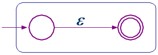
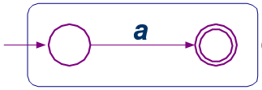
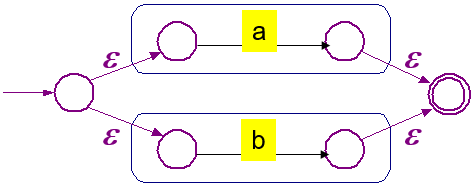
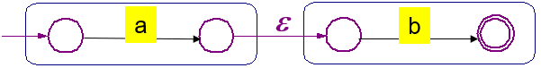
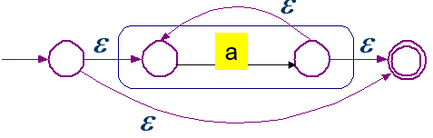
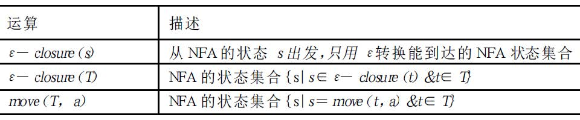
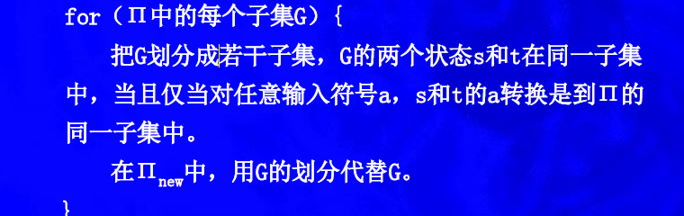
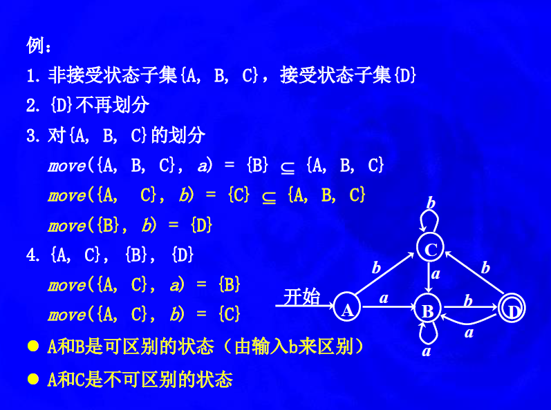
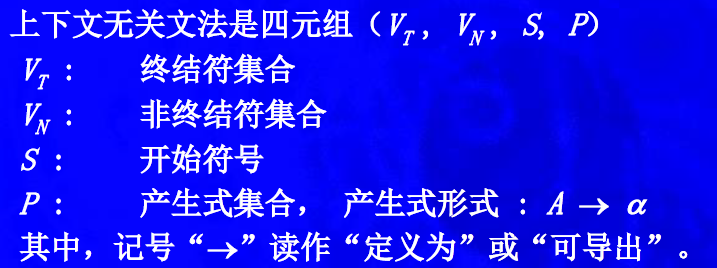
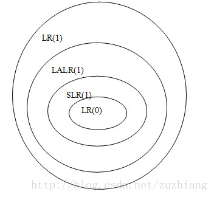

# 编译原理知识点汇总
## 编译程序包含有多少个阶段，各阶段的功能任务分别是什么？
6个阶段
- 扫描程序阶段：执行词法分析，从字符流中收集字符序列到称作记号的有意义单元中
- 语法分析阶段：从扫描程序中获取记号形式的源码，完成定义程序结构元素及关系的工作。
- 语义分析阶段：分析静态语义（包括声明和类型检查），得到程序计算的额外信息
- 源代码优化阶段：完成代码优化
- 代码生成阶段：生成目标代码
- 目标代码优化阶段：改进目标代码，将速度慢的指令改成速度快的，删除冗余操作

## 词法分析
- 正则表达式
- NFA:非确定有限状态机
- DFA:确定有限状态机

### NFA vs DFA
两种的差别在于确定和不确定，也就是对于转换函数 δ 的限制：

- DFA 的转换函数 δ  对于一组输入 ( s , c ) , s ∈ S , c ∈ ∑ (s,c),s∈S,c∈∑ 有唯一确定的输出，即 ∣ δ ( s , c ) ∣ = 1 | 
- 而 NFA 的转换函数对于同一种输入则可能存在多个输出状态，即 ∣ δ ( s , c ) ∣ > 0 

### 正则表达式转NFA:Thompson 构造法

#### 基础规则
1. 对于 ε，构造为

2. 对于a （输入的字符以a为例），构造为

一个圆圈前加一个箭头表示初始状态，两个圆圈表示终结状态，中间用箭头连接，箭头上标明要输入的字符
#### 归纳规则

1. 对于 a | b，构造为

2. 对于 ab，构造为

3. 对于 a*  = a^n |  ε，构造为

- 增加一个新的开始状态和一个新的结束状态。
- 将新的开始状态指向原来所有的开始状态。原来的终结状态指向新的终结状态。弧上为 ε 。

### NFA转DFA:子集构造算法

构造D的状态集合Dstates和转换表Dtran。D 的每个状态对应于NFA的一个状态集合，它是Ｎ读了某个符号串后所能到达的全部状态，包括ε转换后的所有状态。

例如，读了输入a1a2… an后,NFA能到达的所有状态：s1,s2, …, sk，则DFA到达状态{s1,s2, …, sk}

D 的开始状态是ε-closure(s0)。如果D 的状态是至少含Ｎ的一个接受状态的状态集，那么它是D 的一个接受状态。

- 在读入第一个输入符号前，N可以处于ε-closure（s0）中的任何一个状态，其中s0是N 的初始状态。
- 假定集合T是从s0出发，面临某个输入串所能到达的所有状态的集合，令a是下一个输入符号，那么看见a时，N可以移动到集合move（T,a）中的任何一个状态。
- 由于允许ε转换，看见a后，N可以处于ε-closure（move（T,a））中的任何一个状态。

### DFA最小化（子集构造法不一定得到最小化DFA）
每一个正规集都可以由一个状态数最少的DFA识别，这个DFA是唯一的。

1. 构造状态集合的初始划分Π：分成两个子集，接受状态子集F和非接受状态子集S-F。
2. 应用下面的过程对Π构造新的划分Πnew。

举例：

## 语法分析
### 处理文法的语法分析器的三种类型
- 通用
- 自顶向下：从语法分析树的顶部（根结点）开始向底部（叶子结点）构造语法分析树
- 自底向上：从叶子结点开始向根部逐渐构造

编译器中常用的是自顶向下和自底向上的。
### 上下文无关文法

### 分离词法分析器的理由

1. 若把词法分析和语法分析合在一起，则必须将语言的注解和空白的规则反映在文法中，文法将大大复杂
2. 注解和空白由自己来处理的分析器，比注解和空格已由词法分析器删除的分析器要复杂得多

### 设计文法
1. 消除二义性
2. 消除左递归
3. 提取左公因子
### 自顶向下方法
1. 非递归下降分析法
2. 递归下降分析法
3. LL(1)

### 自底向上方法
1. LR(0)
2. SLR
3. LR(1)
4. LALR

## 杂
### 语言的分类

机器语言、汇编语言、高级程序语言

### 什么是自顶向下分析法
- 面向目标的分析方法
- 也就是从文法的开始符号企图推导出与输入的单词符号串完全相匹配的句子，若是输入串是给定文法的句子，则必能推导出，反之则必然出错。

### 在自顶向下的分析过程中，存在的问题是什么？
需对文法有一定限制

### 什么是确定的自顶向下分析法？
- 定义： 确定的自顶向下分析方法,是从文法的开始符号出发,考虑如何根据当前的输入符号 (单词符号)唯一地确定选用哪个产生式替换相应非终结符以往下推导,或如何构造一棵相 应的语法树。
- 特点：实现方法简单、直观，便于手工构造或自动生成语法分析器，是最常用的语法分析方法之一
- 区别：自顶向下的不确定分析方法是带回溯的分析方法

#### 存在的问题
当一个非终结符号对应若干个规则时，选择哪个规则的右部对该非终结符号进行展开呢？

例如：如果要被代换的最左非终结符号是U，且有n条规则：U::=A1|A2|…|An，那么如何确定用哪个规则的右部去替代U？
